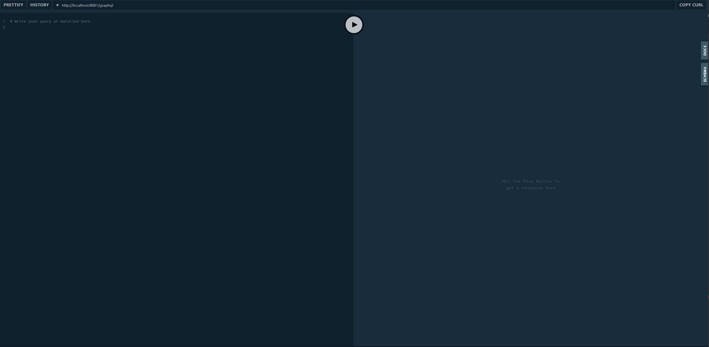

# Playground
> 在使用 Graphql 之后,我们应该如何测试我们的接口呢。最简单的方式就是使用PLayGround了

## 何为Playground
对于Restful接口，我们有Postman之类的请求工具，Playground就是Graphql的一个请求工具。

## 如何使用
1. 首先引入如下包
```xml
           <dependency>
                <groupId>com.graphql-java-kickstart</groupId>
                <artifactId>playground-spring-boot-starter</artifactId>
                <version>11.1.0</version>
            </dependency>
```
2. 引入包之后，我们启动程序，在浏览器上打开如下页面 http://localhost:8081/playground


3. 如何查询一个接口
```graphql
query{
  customer(id:1){
    customerName
    customerAddress
  }
}
```
我们可以在左侧输入框中输入以上Query查询客户相关信息